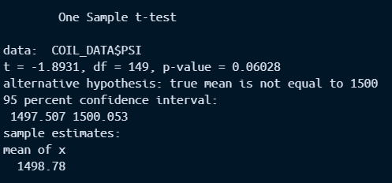
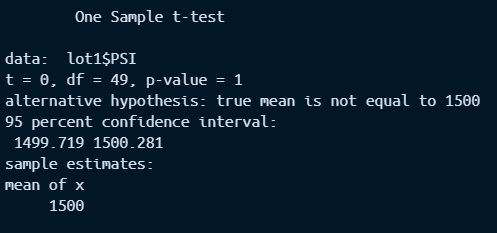
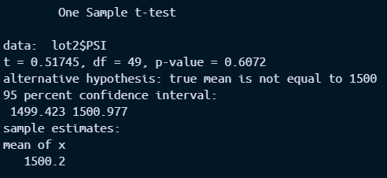
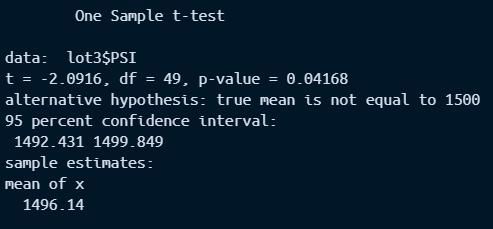

# MechaCar Statistical Analysis

## LInear Regression to Predict MPG

To predict the miles per gallon (mpg) of MechaCar prototypes, we produced a model using all of the provided variables in our dataset. From our model, we have found that vehicle length (p = 5.08e-8) and ground clearance (p = 5.21e-8) are the two coefficients that have provided a non-random amount of variance to the mpg values in the dataset. It should be noted, however, that since this model is contingent on all five variables predicting mpg, there is the possibility of the variables confounding each other - for example, vehicle length and vehicle weight could be related or provide us similar information - which can change how we interpret which variables are explaining our data if we produce further models with less variables.

Our model gives us an r^2 value of .7149 and an adjusted r^2 of .6825 (the adjusted r^2 corrects for each added term, penalizing models for unnecessary complexity). While differing slightly, these two values are close enough for us to feel confident that our model is not too complex and we can rely on our r^2 value. Using this, we can interpret that about 71.5% of the variation in our data can be explained by the model, with an overall positive relationship between mpg and the other variables. In other words, the slope of the linear model is _not_ considered to be zero, but in fact positive/upward. Moreover, as our p-value is also so low (p = 5.35e-11), we are incredibly confident that the produced linear model effectively predicts the mpg of MechaCar prototypes.

## Summary Statistics on Suspension Coils

According to design specifications for the MechaCar, the variance of the suspension coils _must not exceed 100 pounds per square inch_. As seen below, on overview of the MechaCar suspension coils at all lots is well within this metric, with a general variance of about 62.29 pounds per square inch:

However, this changes as we breakdown the analysis to individual manufacturing lots. Lots 1 and 2 are within specifications, with variances of about 0.98 and 7.47 pounds per square inch, respectively. No changes are recommended for their manufacturing processes at this time.

Lot 3, however, is far above the variance threshold, with a MechaCar suspension coil variance of about 170.29. It is recommended that AutosRUs investigate the manufacturing process at Lot 3 and make any necessary changes to bring its variance back within listed specifications:

## T-tests on Suspension Coils

T-Tests have been run to determine whether the mean PSI for all lots together, as well as individually, were statistically different than the MechaCar population mean of 1500 pounds per square inch.

### All Lots

As seen in the image below, we received a p-value of 0.06028 and produced and are 95% confident that the interval estimate of [1497.507, 1500.053] contains the true mean of all the lots:

Since our p-value is above our threshold of .05 and since the confidence interval contains the population mean, we _cannot reject_ the null hypothesis that the true mean PSI of all the lots is equal to the population mean of 1500 pounds per square inch. 

### Lot 1

When we compared Lot 1's mean PSI to the population mean, we received a p-value of 1 and are 95% confident that the interval estimate of [1499.719, 1500.281] contains the true mean for Lot 1:

Since our p-value is far above our threshold of .05 and since the confidence interval contains the population mean, we _cannot reject_ the null hypothesis that the true mean PSI of Lot 1 is equal to the population mean of 1500 pounds per square inch.

### Lot 2

When we compared Lot 2's mean PSI to the population mean, we received a p-value of 0.6072 and are 95% confident that the interval estimate of [1499.423, 1500.977] contains the true mean for Lot 2:

Since our p-value is far above our threshold of .05 and since the confidence interval contains the population mean, we _cannot reject_ the null hypothesis that the true mean PSI of Lot 1 is equal to the population mean of 1500 pounds per square inch.

### Lot 3

When we compared Lot 3's mean PSI to the population mean, we received a p-value of 0.4168 and are 95% confident that the interval estimate of [1492.431, 1499.849] contains the true mean for Lot 3:

Our p-value is lower than our threshold of .05 and the confidence interval does not contain the population mean. Therefore, we _reject_ the null hypothesis and accept the alternative hypothesis that the true mean PSI of Lot 3 is _not equal_ to the population mean of 1500 pounds per square inch. It is recommended that AutosRUs investigate Lot 3's manufacturing process and make any necessary changes to bring Lot 3's mean PSI in line with the population.

## Study Design: MechaCar vs Competition

To deepen our understanding of the MechaCar and how it compares to the competition, more studies will be required. Below we have suggested some study designs to elevate the MechaCar in the market.

### City Fuel Efficiency vs the Competition

Since much of the AutosRUs consumer base is primarily located within cities, we suggest further studies on the MechaCar's fuel efficiency with city driving. One of AutosRUs' main competitors has recently released a vehicle with a stated city fuel efficiency of 35 miles per gallon (mpg). With new efficiency designs being added to the MechaCar, it will be useful to determine if its mileage in the city is statistically better than the competition's.

#### Hypotheses

Null: The MechaCar's city fuel efficiency is equal to 35 miles per gallon, (H_0: mu = 35)

Alternative: The MechaCar's city fuel efficiency is greater than 35 miles per gallon, (H_a: mu > 35)

#### Statistical Test

To perform this test, we suggest using a One-Tailed T-Test. This was chosen for two distinct reasons:

1) The T-Test allows us to compare the means between two samples or populations, alerting us if there is a statistical difference between the given means. By this comparison, we can determine whether the MechaCar's city fuel efficiency is different from the competition's.

2) By making the test one-tailed, we are looking at whether the MechaCar is _more_ fuel efficient with city driving than the competition. This is important as we do not care whether our product is mererly _different_ than the competition's, but is _better_ than theirs.

#### Data

Since our competitor has already released its new car, we already have their information on its city fuel efficiency (35 mpg). This makes data collection easier for us, since we only need to collect data on the MechaCar's city fuel efficiency. This can be obtained by driving the cars around in the city, or city-like conditions, and generating enough data to be effectively used in the test.

