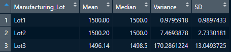

# MechaCar Statistical Analysis

## LInear Regression to Predict MPG

To predict the miles per gallon (mpg) of MechaCar prototypes, we produced a model using all of the provided variables in our dataset. From our model, we have found that vehicle length (p = 5.08e-8) and ground clearance (p = 5.21e-8) are the two coefficients that have provided a non-random amount of variance to the mpg values in the dataset. It should be noted, however, that since this model is contingent on all five variables predicting mpg, there is the possibility of the variables confounding each other - for example, vehicle length and vehicle weight could be related or provide us similar information - which can change how we interpret which variables are explaining our data if we produce further models with less variables.

Our model gives us an r^2 value of .7149 and an adjusted r^2 of .6825 (the adjusted r^2 corrects for each added term, penalizing models for unnecessary complexity). While differing slightly, these two values are close enough for us to feel confident that our model is not too complex and we can rely on our r^2 value. Using this, we can interpret that about 71.5% of the variation in our data can be explained by the model, with an overall positive relationship between mpg and the other variables. In other words, the slope of the linear model is _not_ considered to be zero, but in fact positive/upward. Moreover, as our p-value is also so low (p = 5.35e-11), we are incredibly confident that the produced linear model effectively predicts the mpg of MechaCar prototypes.

## Summary Statistics on Suspension Coils

According to design specifications for the MechaCar, the variance of the suspension coils _must not exceed 100 pounds per square inch_. As seen below, on overview of the MechaCar suspension coils at all lots is well within this metric, with a general variance of about 62.29 pounds per square inch:

However, this changes as we breakdown the analysis to individual manufacturing lots. Lots 1 and 2 are within specifications, with variances of about 0.98 and 7.47 pounds per square inch, respectively. No changes are recommended for their manufacturing processes at this time.

Lot 3, however, is far above the variance threshold, with a MechaCar suspension coil variance of about 170.29. It is recommended that AutosRUs investigate the manufacturing process at Lot 3 and make any necessary changes to bring its variance back within listed specifications:

## T-tests on Suspension Coils

## Study Design: MechaCar vs Competition
